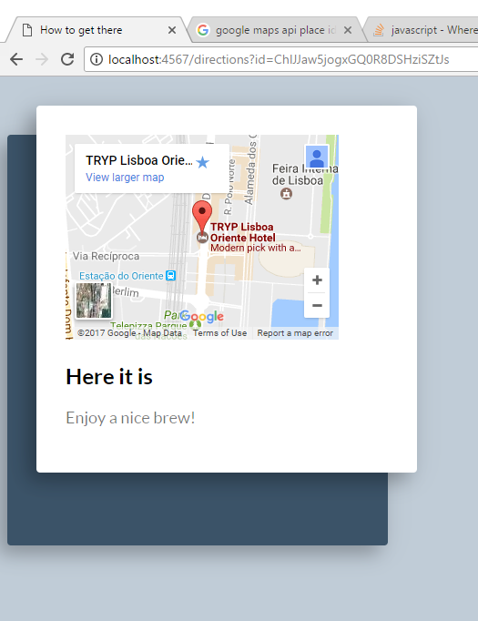

# whatthehack-challenge

Repo for the Lisbon What The Hack Challenge 2017

Challenge selected:

`When I have to scroll over endless feeds when I'm in a new city
and just want to find a cool place to have a drink.`

## Idea for solution

Create a small web app that uses geolocation to figure out where the person is located. Then use the 
Google Places API to search for bars within a 1.500 meter radius (walking distance).

The bars are then ranked by the rating that they have, and the bar with the highest rating is selected.
This is then presented to the user, with the option of showing on Google Maps where it is exactly, and
how to get there.

## Implementation details

Since I am an old fart, I will go against the current fads and code the solution in Java.

Current location is estimated using the HTML Geolocation API.

The search for bars will be done against Google Places and Google Maps APIs, so I registered for API keys for both services.

The app will look for bars in the vicinity of the current location, and return the open bar with the highest rating.

For the web server, the app will use the Spark framework, and for HTML page creation it will use the 
Freemarker template engine.

The Google Places API returns the data as Json, and Json parsing will be done in Java using the Jackson framework.

I am not a designer, so for the HTML/CSS I sought help and inspiration on codepen:

https://codepen.io/mblode/pen/rxNoYd

## Executing the web application

A run of the application looks as follows:

Start the application:1. 

2. When the person clicks on the Go button, the application performs a search, and the best result is presented:

3. To see a map with possible directions, the persons clicks the Show Me button.

4. If there are no bars nearby, or if none are open, the following screen is shown:

